<!-- ═══════════════════════════════════════════════════════════ -->
<!--                    HEADER & IDENTITY                      -->
<!-- ═══════════════════════════════════════════════════════════ -->

<div align="center">



[](https://git.io/typing-svg)

<br/>


&nbsp;


<br/><br/>

<a href="https://www.linkedin.com/in/rahul-chaudhari-06ba06373/" target="_blank">
</a>
&nbsp;
<a href="mailto:Relvixx89@gmail.com">
</a>
&nbsp;
<a href="https://discord.com/users/1492487939698069524">
</a>

</div>

---

<!-- ═══════════════════════════════════════════════════════════ -->
<!--                       ABOUT ME                            -->
<!-- ═══════════════════════════════════════════════════════════ -->


## 🤖 `$ cat about_me.yaml`

```yaml
───────────────────────────────────────────────
  name        : "Rahul Choudhary"
  role        : "Robotics & Automation Student"
  university  : "MET Bhujbal Knowledge City — IOT"
  year        : "2nd Year (2025–2029)"
  location    : "India 🇮🇳"
───────────────────────────────────────────────
  currently   :
    - 🔭 Building → Hand gesture-controlled robot
    - 🌱 Learning → OpenCV, MediaPipe, ROS2 basics
    - 💬 Ask me  → Arduino projects, OpenCV, Python
    - ⚡ Fun fact → I debug hardware with a multimeter
                    and bugs in code with caffeine ☕
───────────────────────────────────────────────
  interests   :
    - "Computer Vision & Perception"
    - "Embedded Systems & Arduino"
    - "Robotics & Automation"
    - "Project-Based Learning"
───────────────────────────────────────────────
  available   : "Internships | Collabs | Learning Groups"
  open_source : true
───────────────────────────────────────────────
```

<br clear="right"/>

---

<!-- ═══════════════════════════════════════════════════════════ -->
<!--                    CURRENT FOCUS                          -->
<!-- ═══════════════════════════════════════════════════════════ -->

## 🟢 Right Now

```javascript
const now = {
  building  : "🤖 Hand Gesture Robot (MediaPipe + Arduino)",
  learning  : "📚 OpenCV, ROS2 fundamentals, sensor integration",
  exploring : "🔬 Motion detection, object tracking, embedded C",
  seeking   : "🔭 Internships & hands-on project collaborations",
  updated   : "May 2026"
}
```

---

<!-- ═══════════════════════════════════════════════════════════ -->
<!--                    GITHUB STATS                           -->
<!-- ═══════════════════════════════════════════════════════════ -->

## 📊 GitHub Analytics

<div align="center">

[](https://github.com/Relvixx)
[](https://github.com/Relvixx)

<br/>

[](https://git.io/streak-stats)

</div>

---

<!-- ═══════════════════════════════════════════════════════════ -->
<!--                  CONTRIBUTION GRAPH                       -->
<!-- ═══════════════════════════════════════════════════════════ -->

## 📈 Contribution Activity

<div align="center">

[](https://github.com/ashutosh00710/github-readme-activity-graph)

</div>

---

<!-- ═══════════════════════════════════════════════════════════ -->
<!--                    TECH STACK                             -->
<!-- ═══════════════════════════════════════════════════════════ -->

## 🛠️ Tech Stack

> Tools and technologies I actively use in my projects.

<div align="center">

<details open>
<summary><b>🤖 Robotics & Hardware</b></summary>
<br/>


</details>

<details open>
<summary><b>💻 Programming Languages</b></summary>
<br/>


</details>

<details open>
<summary><b>🧠 AI & Computer Vision</b></summary>
<br/>


</details>

<details open>
<summary><b>⚙️ Tools & Platforms</b></summary>
<br/>


</details>

</div>

<div align="center">

**Currently exploring:** ROS2 · Raspberry Pi · Embedded C · Supabase · TensorFlow basics

</div>

---

<!-- ═══════════════════════════════════════════════════════════ -->
<!--                    CURRENT FOCUS AREAS                    -->
<!-- ═══════════════════════════════════════════════════════════ -->

## 🎯 Current Focus Areas

```
  Arduino Robotics        ████████████████░░░░   Actively building projects
  OpenCV & Vision         ███████████████░░░░░   90-day learning challenge in progress
  MediaPipe Tracking      ██████████████░░░░░░   Used in gesture robot project
  Python                  ████████████████░░░░   Primary language for all projects
  Embedded Systems        ██████████░░░░░░░░░░   Learning fundamentals
  ROS2                    ████░░░░░░░░░░░░░░░░   Just getting started
```

---

<!-- ═══════════════════════════════════════════════════════════ -->
<!--                  FEATURED PROJECTS                        -->
<!-- ═══════════════════════════════════════════════════════════ -->

## 🚀 Featured Projects

> These are real projects in my repos — click to explore the code.

<div align="center">

<a href="https://github.com/Relvixx/Hand_Gesture_Robot">
  
</a>
<a href="https://github.com/Relvixx/Learning_OpenCV">
  
</a>
<a href="https://github.com/Relvixx/Motion_Detector_Security_Camera">
  
</a>
<a href="https://github.com/Relvixx/Arduino_uno_projects">
  
</a>
<a href="https://github.com/Relvixx/INNOVATEX">
  
</a>

</div>

---

<!-- ═══════════════════════════════════════════════════════════ -->
<!--                   LEARNING ROADMAP                        -->
<!-- ═══════════════════════════════════════════════════════════ -->

## 🗺️ Learning Roadmap

```
  CURRENT SEMESTER GOALS
  ════════════════════════════════════════════════════

  [✅] OpenCV fundamentals — image processing & filters
  [✅] MediaPipe hand tracking — gesture recognition
  [✅] Arduino sensor integration — IR, ultrasonic, servo
  [✅] Motion detection with OpenCV
  [🔄] 90-day OpenCV learning challenge
  [🔄] Hand gesture → robot control pipeline
  [📋] ROS2 Humble — basic navigation concepts
  [📋] Raspberry Pi integration with camera module
  [📋] Object detection with YOLO (getting started)
  [📋] Supabase backend for IoT data logging

  LEGEND:  ✅ Done  |  🔄 In Progress  |  📋 Planned
```

---

<!-- ═══════════════════════════════════════════════════════════ -->
<!--                    TROPHIES                               -->
<!-- ═══════════════════════════════════════════════════════════ -->

## 🏆 GitHub Trophies

<div align="center">

[](https://github.com/ryo-ma/github-profile-trophy)

</div>

---

<!-- ═══════════════════════════════════════════════════════════ -->
<!--                WAKATIME (auto-updated)                    -->
<!-- ═══════════════════════════════════════════════════════════ -->

## ⏱️ Coding Activity

<div align="center">

<!--START_SECTION:waka-->


**🐱 My GitHub Data** 

> 📦 162.6 kB Used in GitHub's Storage 
 > 
> 🏆 107 Contributions in the Year 2026
 > 
> 🚫 Not Opted to Hire
 > 
> 📜 10 Public Repositories 
 > 
> 🔑 5 Private Repositories 
 > 
📊 **This Week I Spent My Time On** 

```text
💬 Programming Languages: 
Markdown                 1 hr 8 mins         ██████████████████████░░░   86.32 % 
Other                    10 mins             ███░░░░░░░░░░░░░░░░░░░░░░   13.68 % 

🔥 Editors: 
Antigravity              1 hr 18 mins        █████████████████████████   100.00 % 
```

**I Mostly Code in Python** 

```text
Python                   7 repos             ███████████░░░░░░░░░░░░░░   43.75 % 
TypeScript               5 repos             ████████░░░░░░░░░░░░░░░░░   31.25 % 
HTML                     2 repos             ███░░░░░░░░░░░░░░░░░░░░░░   12.50 % 
JavaScript               1 repo              ██░░░░░░░░░░░░░░░░░░░░░░░   06.25 % 
C++                      1 repo              ██░░░░░░░░░░░░░░░░░░░░░░░   06.25 % 
```


**Timeline**


 Last Updated on 21/05/2026 20:17:58 UTC
<!--END_SECTION:waka-->

</div>

---

<!-- ═══════════════════════════════════════════════════════════ -->
<!--                 SNAKE CONTRIBUTION                        -->
<!-- ═══════════════════════════════════════════════════════════ -->

## 🐍 Contribution Snake

<div align="center">

<picture>
  <source media="(prefers-color-scheme: dark)" srcset="https://raw.githubusercontent.com/Relvixx/Relvixx/output/github-snake-dark.svg" />
  <source media="(prefers-color-scheme: light)" srcset="https://raw.githubusercontent.com/Relvixx/Relvixx/output/github-snake.svg" />
  
</picture>

</div>

---

<!-- ═══════════════════════════════════════════════════════════ -->
<!--                 ABOUT & INTERESTS                         -->
<!-- ═══════════════════════════════════════════════════════════ -->

## 🔩 A Bit More About Me

<details>
<summary><b>📚 Books on My Reading List</b></summary>
<br/>

- 📖 *Programming Robots with ROS* — Quigley, Gerkey & Smart
- 📖 *Modern Robotics: Mechanics, Planning & Control* — Lynch & Park
- 📖 *Learning OpenCV 4* — Kaehler & Bradski
- 📖 *The Innovators* — Walter Isaacson

</details>

<details>
<summary><b>⚡ Fun Facts</b></summary>
<br/>

- 🤖 Built my first line-following robot using an Arduino and IR sensors
- ☕ My code compiles faster after coffee — scientifically unproven but personally confirmed
- 🌙 Some of my best engineering breakthroughs happen at 2 AM
- 🌍 Dream: Build robots that solve real-world problems

</details>

---

<!-- ═══════════════════════════════════════════════════════════ -->
<!--                   CONNECT                                 -->
<!-- ═══════════════════════════════════════════════════════════ -->

## 🌐 Let's Connect

<div align="center">

<a href="https://www.linkedin.com/in/rahul-chaudhari-06ba06373/" target="_blank">
</a>
&nbsp;
<a href="mailto:Relvixx89@gmail.com">
</a>

<br/><br/>

```
╔══════════════════════════════════════════════════════════╗
║   📬  Open to: Internships  |  Project Collaborations    ║
║   🤝  Available for: Open Source & Learning Groups       ║
║   🌍  Location: India  |  Remote-friendly 🌐             ║
╚══════════════════════════════════════════════════════════╝
```

</div>

---

<!-- ═══════════════════════════════════════════════════════════ -->
<!--                     FOOTER                                -->
<!-- ═══════════════════════════════════════════════════════════ -->

<div align="center">


</div>

<div align="center">


</div>
